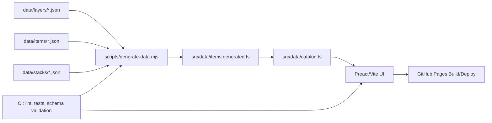
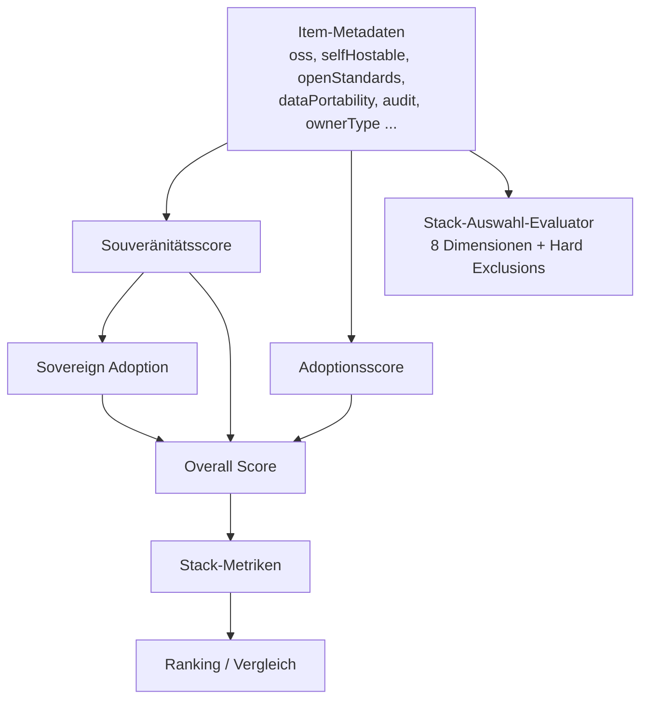

# Digitale Souveränität und StackAtlas

## Executive Summary

Digitale Souveränität ist in der aktuellen Forschung kein enger, eindeutig definierter Technikbegriff, sondern ein umkämpftes Mehrebenenkonzept. Die Literatur bewegt sich zwischen staatlicher und europäischer Handlungsfähigkeit, organisatorischer Steuerungsfähigkeit, individueller Selbstbestimmung sowie normativen Fragen von Offenheit, Kontrolle, demokratischer Rechenschaft und Resilienz. Besonders belastbar sind dabei drei Beobachtungen: Erstens ist der Begriff kontextabhängig und umstritten; zweitens lässt er sich sinnvoll nur mehrdimensional messen; drittens genügt weder bloße Regulierung noch bloße Open-Source-Rhetorik, um Souveränität praktisch herzustellen. citeturn46view0turn50view0turn46view1turn46view3turn49search2turn45search19

StackAtlas operationalisiert digitale Souveränität nicht in ihrer ganzen politischen Breite, sondern vor allem als **entscheidungsorientierte, technisch-organisatorische Bewertbarkeit von Technologie-Stacks**. Das ist eine Stärke, weil dadurch Kriterien wie Selbsthostbarkeit, Datenportabilität, Offenheit, Auditierbarkeit, Abhängigkeiten, Rollen und Governance überhaupt erst vergleichbar werden. Zugleich ist es eine Begrenzung: Aspekte wie demokratische Legitimation, Kompetenzaufbau, Marktstruktur, Beschaffungsmacht, rechtliche Durchsetzbarkeit und gesellschaftliche Folgen sind nur teilweise oder indirekt modelliert. Die zentrale analytische Pointe lautet daher: **StackAtlas ist ein transparenter, nützlicher Decision-Support-Prototyp für technologische und organisatorische Souveränität, aber noch kein vollständiges Forschungs- oder Governance-Instrument für digitale Souveränität im umfassenden Sinne.** citeturn32view0turn15view1turn15view2turn24view3turn46view3turn50view0

Im Repository-Befund zeigt sich ein überraschend reifes technisches Fundament: statische, lokal kompilierbare Architektur; klare JSON-Schemata; generierte Katalogdaten; explizites Abhängigkeitsmodell; versionskontrollierte Bewertungslogiken; PWA-Betrieb; CI mit Linting, Tests, Schema-Validierung, Drift-Checks, Dependabot und CodeQL; sowie eine copyleft-orientierte Open-Source-Lizenz (EUPL-1.2). Schwächer ausgeprägt sind dagegen Export/Import für lokal gespeicherte Nutzerdaten, ein explizites Datenschutz- und Threat-Model, eine sichtbar operationalisierte Evidenzklassifikation für Belege, sowie eine formale Forschungsvalidierung der Gewichte und Schwellenwerte. citeturn38view0turn39view0turn36view0turn36view1turn36view2turn36view3turn52view0turn43view0

Für Praxis und Politik ist StackAtlas deshalb vor allem dort relevant, wo Beschaffung, Referenzarchitektur, Standardisierung und Plattformsteuerung zusammenkommen: in öffentlicher Verwaltung, föderaler IT-Koordinierung, Architekturboards, Open-Source-Programmen und intergouvernementalen Vergleichsvorhaben. Politisch ist das Werkzeug aber nicht neutral: Seine Gewichte und Modellentscheidungen legen fest, **welche Form von Souveränität** zählt. Gerade das macht StackAtlas interessant – und forschungsbedürftig. citeturn32view0turn27view0turn46view3turn50view0

## Forschungsstand und Begriffsrahmen

Die neuere Forschung beschreibt digitale Souveränität überwiegend nicht als singuläre Eigenschaft, sondern als Zusammenspiel von **Autonomie, Kontrolle, Handlungsfähigkeit, Offenheit, Rechenschaft, Sicherheit und Werteinbettung**. entity["people","Stephane Couture","digital media scholar"] und entity["people","Sophie Toupin","internet governance scholar"] zeigen 2019, dass „Souveränität“ im Digitalen von sehr unterschiedlichen Akteursgruppen mobilisiert wird und je nach Perspektive Unabhängigkeit, Kontrolle oder Autonomie über Infrastrukturen, Technologien und Daten meint. entity["people","Julia Pohle","digital policy scholar"] und entity["people","Thorsten Thiel","democracy digitalisation researcher"] präzisieren 2020, dass der Begriff zwar politisch zentral geworden ist, aber analytisch umkämpft bleibt und häufig eher als diskursive Praxis denn als klar abgegrenztes Rechts- oder Organisationskonzept fungiert. citeturn46view0turn50view0

Die europäische Forschung verschiebt den Akzent zuletzt deutlich von bloßer Souveränitätsbehauptung zu **„offener Autonomie“**. Der Joint Research Centre der entity["organization","European Commission","eu executive body"] definiert 2025 digitale Souveränität ausdrücklich als Fähigkeit, **unabhängig zu handeln und zugleich offen und vernetzt zu bleiben**. Diese Sicht verbindet Unabhängigkeit mit Demokratie, Offenheit, Rechtsstaatlichkeit, Wettbewerbsfähigkeit, Resilienz und Vertrauen; sie grenzt sich ausdrücklich gegen Isolationismus und Protektionismus ab. citeturn46view3

Für den deutschsprachigen Diskurs ist wichtig, dass ältere, aber weiterhin einflussreiche Arbeiten den Begriff stärker von der **Handlungs- und Entscheidungsfähigkeit von Individuen und Institutionen** her denken. Die Studie „Digitale Souveränität“ von Goldacker betont, dass institutionelle digitale Souveränität ohne individuelle digitale Souveränität der Beschäftigten nicht tragfähig ist. Der Verbraucherforschungsbericht „Digital Sovereignty“ arbeitet mit vier Leitprinzipien – Freiheit der Wahl, Selbstbestimmung, Selbstkontrolle und Sicherheit – und verbindet Souveränität mit Technik, Kompetenz und verbraucherfreundlicher Regulierung. citeturn45search1turn45search16

Aktuelle Forschung zur Operationalisierung geht nochmals einen Schritt weiter. entity["people","María del Pilar Rodriguez Pita","telecom researcher"] und Koautoren schlagen 2025 digitale Souveränität als **quantifizierbares, multidimensionales Framework** vor, das Technologie, Staat und Gesellschaft zusammendenkt. Die JRC-Studie von 2025 formuliert ergänzend eine Vier-Ebenen-Architektur aus Governance, Infrastrukturen/Software/Daten, Produkten/Märkten und Menschen. Beide Arbeiten sind für StackAtlas besonders relevant, weil sie zeigen, dass keine einzelne Kennzahl – etwa „Open Source“ oder „EU-Hosting“ – genügt. citeturn46view1turn46view3

Die Debatte um digitale Souveränität ist zudem von einer produktiven Spannung geprägt: zwischen Rhetorik und materiellen Kapazitäten. Die Literatur zu „digital sovereignty – rhetoric and reality“ macht sichtbar, dass politische Leitbilder nur dann tragfähig sind, wenn sie in Infrastruktur, Kompetenzen, Marktstrukturen, Standards und Steuerungsinstrumente übersetzt werden; eine aktuelle Rapid Review zu Open Source betont entsprechend, dass OSS allein nicht genügt, sondern mit Governance, langfristigem Kompetenzaufbau und Investitionen verbunden werden muss. citeturn49search1turn49search2

Die folgende Übersicht bündelt die für diese Analyse wichtigsten Referenzen.

| Publikation                                                                 | Autoren                                                                                                                                | Jahr | Kernaussage für diese Analyse                                                                                                                                                                 |
| --------------------------------------------------------------------------- | -------------------------------------------------------------------------------------------------------------------------------------- | ---- | --------------------------------------------------------------------------------------------------------------------------------------------------------------------------------------------- |
| _What does the notion of “sovereignty” mean when referring to the digital?_ | entity["people","Stephane Couture","digital media scholar"]; entity["people","Sophie Toupin","internet governance scholar"]      | 2019 | Digitale Souveränität bezeichnet keine einheitliche Lehre, sondern divergierende Ansprüche auf kollektive Kontrolle über Inhalte, Infrastrukturen und Technologien. citeturn46view0        |
| _Digitale Souveränität_                                                     | G. Goldacker                                                                                                                           | 2017 | Institutionelle Souveränität setzt personale/individuelle Souveränität voraus; der Begriff ist nicht rein technisch. citeturn45search1                                                     |
| _Digital sovereignty_                                                       | entity["people","Julia Pohle","digital policy scholar"]; entity["people","Thorsten Thiel","democracy digitalisation researcher"] | 2020 | Der Begriff ist zentral in Politikdiskursen, aber hochgradig umstritten; er fungiert oft eher als normative und politische Praxis denn als präzise Organisationskategorie. citeturn50view0 |
| _Digital Sovereignty_                                                       | Sachverständigenrat/Verbraucherforschung                                                                                               | 2017 | Leitprinzipien: Wahlfreiheit, Selbstbestimmung, Selbstkontrolle, Sicherheit; Souveränität braucht Technik, Kompetenz und Regulierung. citeturn45search16                                   |
| _From concept to method: A framework for measuring digital sovereignty_     | entity["people","María del Pilar Rodriguez Pita","telecom researcher"] et al.                                                       | 2025 | Digitale Souveränität ist multidimensional und sollte als quantifizierbares Framework für langfristige Politikbewertung operationalisiert werden. citeturn46view1                          |
| _Towards a Common Understanding of EU Digital Sovereignty_                  | JRC / entity["organization","European Commission","eu executive body"]                                                              | 2025 | Europäische digitale Souveränität heißt unabhängig handeln, ohne sich abzuschotten; wichtig sind Skills, Infrastrukturen, Governance und Resilienz. citeturn46view3                        |
| _Rapid Review of Digital Sovereignty and Open-Source Software_              | J. A. P. Martins et al.                                                                                                                | 2025 | OSS unterstützt Souveränität nur dann nachhaltig, wenn Governance, Investitionen und technisches Know-how institutionell gesichert werden. citeturn49search2                               |

## Messrahmen und Indikatoren

Aus dem Forschungsstand lässt sich ein **anwendungsorientierter Messrahmen** ableiten, der für StackAtlas sinnvoller ist als eine einzige Sammelkennzahl. Die Literatur legt nahe, mindestens fünf Ebenen zu unterscheiden: erstens Kontrolle und Entscheidungsfähigkeit; zweitens Daten- und Infrastrukturbeherrschung; drittens Interoperabilität und Standards; viertens Transparenz, Governance und Rechenschaft; fünftens Sicherheit, Resilienz und Kompetenzen. Für die öffentliche Verwaltung ergänzt der IT-Planungsrat dies ausdrücklich um strategische Indikatoren zu Abhängigkeiten, Verwundbarkeiten und Technologielandschaften. citeturn46view1turn46view3turn45search19

Für diese Analyse operationalisiere ich digitale Souveränität in zehn Prüfdimensionen. Das folgt methodisch dem Stand der Forschung, aber auch dem, was StackAtlas im Code tatsächlich messen kann. Wichtig ist dabei: Nicht jede Dimension ist im Repository gleich gut beobachtbar. Manche lassen sich direkt aus Code und Datenstruktur prüfen, andere nur indirekt aus Governance- und Dokumentationsartefakten. citeturn46view1turn46view3turn50view0

| Prüfdimension                             | Warum sie in der Forschung zentral ist                                                                                            | Arbeitsdefinition für den StackAtlas-Abgleich                                      |
| ----------------------------------------- | --------------------------------------------------------------------------------------------------------------------------------- | ---------------------------------------------------------------------------------- |
| Kontrolle über Betrieb und Entscheidungen | Souveränität meint Handlungs- und Entscheidungsfähigkeit, nicht bloß Compliance. citeturn45search1turn46view3turn50view0     | Ist das Werkzeug selbst lokal betreibbar, modifizierbar und migrationsfähig?       |
| Datenkontrolle und Portabilität           | Daten- und Exportkontrolle sind wiederkehrende Kernmotive in Forschung und Politik. citeturn46view0turn46view3turn45search16 | Wo liegen Daten? Wie werden Nutzerdaten gespeichert? Gibt es Export/Import?        |
| Interoperabilität und offene Standards    | JRC und IT-Planungsrat behandeln Interoperabilität als strukturelle Voraussetzung. citeturn46view3turn45search19              | Nutzt bzw. modelliert StackAtlas offene Formate, Schemata und Standardbezüge?      |
| Transparenz und Nachvollziehbarkeit       | Forschung betont demokratische Rechenschaft und erklärbare Governance. citeturn50view0turn46view3                             | Sind Datenmodell, Scoring und Belege offen dokumentiert und reproduzierbar?        |
| Open Source und Lizenzregime              | OSS ist wichtig, aber nur ein Teil des Problems. citeturn49search2turn46view3                                                 | Ist der Code offen, nachnutzbar und rechtlich klar lizenzierbar?                   |
| Governance und Verantwortung              | Digitale Souveränität ist mehrschichtig und umfasst Rollen, Regeln, Verantwortlichkeiten. citeturn46view3turn50view0          | Gibt es dokumentierte Rollen, Review-Pfade, normative Dokumente, Maintainer-Logik? |
| Abhängigkeiten und Lock-in                | Strategische Abhängigkeiten sind im EU-Diskurs ein Kernproblem. citeturn46view3turn45search19                                 | Macht das Tool technische und organisatorische Abhängigkeiten sichtbar?            |
| Sicherheit und Resilienz                  | Sicherheit ist in nahezu allen Definitionen präsent. citeturn45search16turn46view3                                            | Gibt es Prüfungen, Security-Workflows, Audits, Update- und Build-Hygiene?          |
| Lokalisierung und regionale Verankerung   | Europäische Souveränität ist offen, aber nicht ortlos; Regionalität bleibt relevant. citeturn46view3turn46view1               | Werden Betreiberland, EU-Verankerung, Sprache und regionale Kontexte modelliert?   |
| Fähigkeiten und Nutzerautonomie           | Souveränität verlangt verständliche, nutzbare Werkzeuge und Kompetenzaufbau. citeturn45search1turn45search16turn46view3      | Unterstützt die App eigenständige Bewertung, Vergleich und lokale Anpassung?       |

Ein wichtiger analytischer Vorbehalt folgt daraus sofort: StackAtlas kann **technologische und organisatorische Souveränität** gut abbilden, **gesellschaftliche und verfassungsförmige Souveränität** aber nur sehr begrenzt. Genau diese Differenz ist in der Forschung zentral – und erklärt später viele der identifizierten Stärken und Lücken. citeturn46view0turn50view0turn46view3

## StackAtlas im Repository-Befund

Das öffentliche Repository von StackAtlas bei entity["company","GitHub","developer platform"] unter dem Account entity["organization","TechGovStacks","public sector stack project"] beschreibt das Projekt fachlich als Werkzeug, das digitale Souveränität von Technologie-Stacks „sichtbar, vergleichbar und entscheidungsfähig“ machen soll. Der Business Case nennt als Nutzenversprechen den Vergleich von Stacks anhand gemeinsamer Kriterien, transparente Bewertungen auf Technologie-, Layer- und Stack-Ebene sowie die Verwendung als Grundlage für Beschaffung, Architekturentscheidungen und Governance. Als Zielgruppen werden ausdrücklich öffentliche Verwaltung, Beschaffung, Architektur- und Plattformteams sowie Governance-, Compliance- und Strategie-Verantwortliche genannt. Die aktive Projektdokumentation ist normativ in `docs/BUSINESS_CASE.md`, `docs/ARC42.md`, `docs/README.md` und `data/README.md` verankert; `docs/archive/` gilt ausdrücklich nur als nicht-normativer Altbestand. citeturn32view0turn44view0

Technisch ist StackAtlas als **statisch generierte Frontend-Anwendung** angelegt. `scripts/generate-data.mjs` liest JSON-Dateien aus `data/layers/`, `data/items/` und `data/stacks/`, berechnet zusätzliche Kennzahlen und schreibt ein generiertes Artefakt `src/data/items.generated.ts`. `src/data/catalog.ts` exportiert daraus `LAYERS`, `ITEMS`, `STACKS`, `DEPENDENCY_GRAPH` und `REVERSE_DEPENDENCIES`. Im Frontend werden Preact, Vite und `@public-ui`-/KERN-Komponenten verwendet; der Produktions-Workflow baut das Projekt und veröffentlicht `dist/` nach GitHub Pages. Das ist eine architektonisch einfache, gut portable und selbst hostbare Struktur. citeturn38view0turn37view0turn42view0turn21view2turn36view3

Das folgende Diagramm abstrahiert die im Repository dokumentierte Daten- und Build-Pipeline. citeturn38view0turn37view0turn36view3

Funktional lässt sich StackAtlas in vier große Kapitel gliedern. Erstens gibt es eine Stack-Galerie mit Ranking, Vergleich und kompakter Navigation (`src/pages/StackGalleryPage.tsx`). Zweitens erlaubt `useLocalStacks.ts` das Erzeugen, Umbenennen, Löschen und lokale Erweitern eigener Stacks im Browser. Drittens visualisiert `src/components/DependencyGraph.tsx` technische Beziehungen zwischen Items. Viertens implementiert `src/components/StackSelectionEvaluator.tsx` einen interaktiven Bewertungsassistenten, der Stack-Items anhand definierter Dimensionen und Ausschlussgründe evaluiert. Hinzu kommen Mehrsprachigkeit (`src/i18n/index.ts`), Theme-Umschaltung einschließlich High-Contrast (`src/hooks/useTheme.ts`, `src/components/SettingsForm.tsx`) sowie PWA-Funktionalität. citeturn42view2turn43view0turn23view1turn24view3turn24view0turn19view0turn18view0turn24view2

Die Architektur der Bewertungslogik ist besonders aufschlussreich. In `src/utils/sovereigntyScore.ts` werden die Gewichte stark auf **Selbsthostbarkeit (20)**, **Datenportabilität (15)**, **Open Source (15)**, **offene Standards (10)** und **permissive Lizenz (10)** ausgerichtet; kleinere Gewichte entfallen auf Audit, Reifegrad, Telemetrieverzicht und EU-Hauptsitz. In `src/utils/overallScore.ts` fließt der Gesamtwert zu **60 %** aus dem Souveränitätsscore, zu **25 %** aus „sovereign adoption“ und zu **15 %** aus Adoptions-/Popularitätswerten ein. Im separaten Auswahl-Evaluator werden zusätzlich acht Dimensionen wie Austauschbarkeit, Betriebs-/Governance-Fähigkeit, Interoperabilität, Standardoffenheit, Steuerbarkeit und Souveränität bewertet. Analytisch bedeutet das: StackAtlas modelliert Souveränität primär als **steuerbare, technische und organisatorische Entscheidungslage** – und nur sekundär als politisches oder gesellschaftliches Großkonzept. citeturn15view1turn15view2turn24view3turn40view0

Das Repository ist zugleich **datenmodellgetrieben**. `data/schemas/item.schema.json` verlangt für jedes Item unter anderem `id`, `name`, `layer`, `description`, `oss` und `sovereigntyCriteria`; zusätzlich modelliert das Schema `researchSources`, `lastResearchDate`, optionale `dependencies`, `license`, `audit`, `github`, `popularityMetrics` und `ownerType`. `data/schemas/stack.schema.json` definiert für Stacks u. a. `name`, `version`, `items` sowie Rollen wie `maintainer`, `contributor`, `funder` und `consumer`. `data/README.md` beschreibt das System programmatisch als Modell, in dem „Items als Dependencies“ behandelt werden; `dependencies` bilden gerichtete Kanten mit Typ, Scope und Begründung. Das ist für Nachvollziehbarkeit und Interoperabilität ein starker Befund. citeturn25view0turn26view0turn25view1

Ein repräsentatives Beispiel ist `data/items/kubernetes.json`. Die Datei enthält nicht nur Beschreibung, Layer, `groupKey`, `homepage`, Lizenz und `sovereigntyCriteria`, sondern auch `audit`, technische `dependencies`, `popularityMetrics`, `lastResearchDate` und `researchSources`. Gerade die Felder `lastResearchDate` und `researchSources` zeigen, dass StackAtlas Quellenprovenienz zumindest auf Datenebene ernst nimmt. Ebenfalls sichtbar ist, dass `dependencies` hier konkrete technische Beziehungen – etwa zu HTTP und TLS – modellieren. citeturn28view1turn31view3turn31view4

Auf der Stack-Ebene ist der Katalog bereits breit. Im Verzeichnis `data/stacks/` liegen zahlreiche nationale und organisationale Beispiele, darunter Australien, Brasilien, Kanada, Deutschland, Frankreich, Indien, Singapur, Vereinigtes Königreich, Vereinigte Staaten, GovStack, EBSI, openDesk und weitere Einträge. Das macht StackAtlas praktisch anschlussfähig für Benchmarking- und Referenzarchitekturszenarien. Beim inspizierten `data/stacks/germany.json` fällt allerdings auf, dass die Datei zwar `issuer`, `version`, `publishedAt` und viele `items` mit Rollen enthält, im sichtbaren Kopfbereich aber keinen `sources`-Block ausweist, obwohl das Schema eine solche Quellenliste unterstützt. Das ist ein konkreter Traceability-Gap. citeturn27view0turn31view1turn26view0

In Bezug auf Nutzbarkeit und Datenschutz zeigt der Code ein konsistentes Muster der **lokalen Browser-Speicherung**. Theme-Präferenz und Sprachdetektion nutzen `localStorage`; der Stack-Auswahl-Evaluator speichert Zustand und Assessments lokal; lokale Nutzungs-Stacks werden ebenfalls ausschließlich im Browser persistiert. `logger.ts` schreibt nur in die Browser-Konsole; `src/data/catalog.ts` importiert statisch generierte Daten statt Laufzeit-APIs. In den von mir eingesehenen Laufzeitdateien war daher keine explizite Analytics- oder Backend-Anbindung dokumentiert. Das spricht für Datensparsamkeit, schafft aber zugleich neue Anforderungen an Export/Import, Löschung und lokale Sicherheitsmodelle. citeturn19view0turn24view0turn24view3turn43view0turn41view0turn37view0

Qualitätssicherung und Betriebsfähigkeit sind für ein junges Projekt bemerkenswert ordentlich dokumentiert. `docs/ARC42.md` nennt Schema-Validierung, Linting und E2E-Tests als Qualitätsmechanismen. Der CI-Workflow führt TypeScript-, ESLint-, Stylelint-, Prettier- und Knip-Prüfungen, Unit-Tests, JSON-Schema-Validierung, Build und Drift-Detection aus; Dependabot aktualisiert npm- und GitHub-Actions-Abhängigkeiten wöchentlich; ein CodeQL-Workflow ist angelegt; Haupt-Deployments publizieren statische Builds auf GitHub Pages. Einschränkend ist aber festzuhalten, dass die Playwright-Smoke-Tests im CI mit `continue-on-error: true` laufen und damit Fehler nicht blockierend sind. Außerdem wird PWA im CI deaktiviert, in der Produktionsauslieferung aber aktiviert; dadurch existiert ein kleiner Test-Produktions-Spalt. citeturn34view1turn36view0turn36view1turn36view2turn36view3

Der rechtliche Lizenzrahmen ist klar: Das Repository steht unter der **European Union Public Licence v. 1.2 (EUPL-1.2)**. Für ein Vorhaben im Verwaltungs- und europäischen Kontext ist das nicht nur juristisch sauber, sondern auch symbolisch angemessen, weil der Code damit offen, weiterverwendbar und copyleft-orientiert nachnutzbar ist. citeturn52view0

## Kriterienspiegel und Abgleich mit StackAtlas

Der entscheidende Punkt ist nun nicht, **ob** StackAtlas „digitale Souveränität“ behandelt, sondern **welche Form** digitaler Souveränität das Projekt tatsächlich operationalisiert. Das folgende Raster gleicht die zuvor abgeleiteten Forschungskriterien systematisch gegen die implementierten Artefakte ab.

| Kriterium                               | Erfüllungsgrad               | Repo-Befund                                                                                                                                                                                                                                                                                                                                      | Konkrete Belege                                                                                                                                                                                                     |
| --------------------------------------- | ---------------------------- | ------------------------------------------------------------------------------------------------------------------------------------------------------------------------------------------------------------------------------------------------------------------------------------------------------------------------------------------------ | ------------------------------------------------------------------------------------------------------------------------------------------------------------------------------------------------------------------- |
| Kontrolle über Betrieb und Deployment   | **stark**                    | Statische Build-Pipeline, generierte lokale Datenartefakte, Deploy auf GitHub Pages; keine erkennbare Pflicht zu SaaS-Backend oder proprietärer Laufzeit.                                                                                                                                                                                        | `scripts/generate-data.mjs`, `src/data/catalog.ts`, `vite.config.ts`, `.github/workflows/deploy-main.yml`. citeturn38view0turn37view0turn21view2turn36view3                                                   |
| Datenkontrolle und Portabilität         | **teilweise**                | Katalogdaten liegen offen als JSON im Repo; lokale Nutzerdaten bleiben im Browser. Aber es gibt in den eingesehenen Dateien keine dokumentierte Export-/Import-Funktion für lokale Stacks, Evaluator-Zustände oder lokale Assessments.                                                                                                           | `data/items/*.json`, `data/stacks/*.json`, `useLocalStacks.ts`, `StackSelectionEvaluator.tsx`, `useTheme.ts`, `src/i18n/index.ts`. citeturn25view0turn43view0turn24view3turn19view0turn24view0               |
| Interoperabilität und offene Standards  | **stark bis teilweise**      | Positiv: JSON-Schemata, formalisierte Dependency-Typen, Layer-Modell, „sovereign-standards“-Ebene, explizite Rolle von Standards. Einschränkung: Keine dokumentierte externe API für Drittsysteme in den inspizierten Dateien.                                                                                                                   | `item.schema.json`, `stack.schema.json`, `data/README.md`, `docs/ARC42.md`. citeturn25view0turn26view0turn25view1turn34view4                                                                                  |
| Transparenz und Nachvollziehbarkeit     | **stark, aber inkonsistent** | Scoringfunktionen, Gewichte und Datenmodell sind offen. Dokumentiert wird sogar ein Anspruch auf „begründete Bewertungen mit Evidenz- und Quellenbezug“. Gleichzeitig ist die im Business Case angekündigte Evidenzlogik (K1–K7, Q1–Q6, Guardrails) in den inspectierten Laufzeitartefakten nicht als eigenes maschinenlesbares Modell sichtbar. | `docs/BUSINESS_CASE.md`, `docs/README.md`, `item.schema.json`, `kubernetes.json`, `sovereigntyScore.ts`, `overallScore.ts`. citeturn32view0turn44view0turn25view0turn31view3turn15view1turn15view2          |
| Open Source und Lizenz                  | **sehr stark**               | Offenes Repository, offene Daten, klarer Lizenzrahmen EUPL-1.2.                                                                                                                                                                                                                                                                                  | `LICENSE`. citeturn52view0                                                                                                                                                                                       |
| Governance und Verantwortung            | **teilweise**                | Positiv: normative Doku-Struktur, Rollenmodell (`maintainer`, `contributor`, `funder`, `consumer`), CI, CLA-/Workflow-Struktur. Negativ: öffentlich sichtbares Maintainer-/Entscheidungsmodell und Evidenz-Review-Prozess bleiben dünn.                                                                                                          | `docs/README.md`, `stack.schema.json`, `.github/workflows/`, `BUSINESS_CASE.md`. citeturn44view0turn26view0turn35view0turn32view0                                                                             |
| Abhängigkeiten und Lock-in              | **stark**                    | Technische Dependencies werden explizit als Graph geführt; `groupKey` modelliert funktionale Alternativen; Scores priorisieren Selbsthostbarkeit, Datenexport und Offenheit. Gleichzeitig besteht für Logos eine kleine externe Supply-Chain zu Simple Icons/Wikidata/Wikipedia.                                                                 | `DependencyGraph.tsx`, `data/README.md`, `item.schema.json`, `generate-data.mjs`, `fetch-external-logos.mjs`, `sovereigntyScore.ts`. citeturn23view1turn25view1turn25view0turn38view0turn39view1turn15view1 |
| Sicherheit und Resilienz                | **mittel**                   | Es gibt Linting, Tests, Schema-Validation, Dependabot, CodeQL und PWA-Update-Logik. Schwächen: PWA-Pfad nicht vollständig CI-identisch; E2E-Smoke-Tests blockieren nicht; ein explizites Threat-Model oder Datenschutzkonzept war in den inspizierten aktiven Dokumenten nicht sichtbar.                                                         | `ARC42.md`, `ci.yml`, `dependabot.yml`, `codeql.yml`, `PwaUpdatePrompt.tsx`, `docs/`-Dateiliste. citeturn34view1turn36view0turn36view1turn36view2turn24view2turn44view0                                     |
| Lokalisierung und regionale Verankerung | **stark bis teilweise**      | UI in acht Sprachen; Kriterien wie `euHeadquartered` und `ownerCountry`; zahlreiche nationale Stack-Dateien. Aber Regionalität ist überwiegend ein Bewertungsmerkmal, keine hart nachgewiesene Betriebs- oder Rechtsgarantie des Tools selbst.                                                                                                   | `src/i18n/index.ts`, `preact.main.tsx`, `item.schema.json`, `data/stacks/`. citeturn24view0turn42view0turn25view0turn27view0                                                                                  |
| Nutzerautonomie und Bedienbarkeit       | **stark**                    | Lokale eigene Stacks, Ranking, Dependency-Visualisierung, Theme, High-Contrast, Mehrsprachigkeit, PWA. Das unterstützt selbständige Exploration. Lücke: fehlender Datenaustausch mit anderen Nutzern/Teams.                                                                                                                                      | `StackGalleryPage.tsx`, `useLocalStacks.ts`, `SettingsForm.tsx`, `useTheme.ts`, `PwaWrapper.tsx`. citeturn42view2turn43view0turn18view0turn19view0turn20view5                                                |

Zwei Befunde sind analytisch besonders wichtig. Erstens operationalisiert StackAtlas Souveränität primär als **User- und Betreiberkontrolle**: Der Kommentar in `sovereigntyScore.ts` stellt ausdrücklich darauf ab, ob Nutzer ein System selbst betreiben können, ihre Daten herausbekommen und Lock-in vermeiden. Zweitens verschiebt derselbe Code das Verständnis von Souveränität in der Maintainer-Perspektive: Wenn ein Stack-Owner als `maintainer` auftritt, gelten mehrere Kontrollkriterien selbst dann als erfüllt, wenn ein Artefakt nicht öffentlich zugänglich oder nicht Open Source ist. Das ist theoretisch spannend, weil hier **Offenheit** und **organisatorische Kontrolle** bewusst auseinandergezogen werden. citeturn15view1

Das folgende Diagramm zeigt vereinfacht, wie StackAtlas aus Metadaten, Rollen und Adoptionswerten zu einem Gesamtranking kommt. Diese Abstraktion folgt direkt den Build- und Runtime-Funktionen im Repository. citeturn38view0turn15view1turn15view2turn40view0

## Bewertung und Empfehlungen

Die größte Stärke von StackAtlas ist seine **methodische Transparenz**. Viele Projekte reden über digitale Souveränität, aber nur wenige legen Datenmodell, Gewichte, Kategorien, Rollen und Build-Logiken so offen. Gerade für Forschung und Verwaltung ist das wertvoll: Das Projekt macht aus einem oft diffus-politischen Leitbild einen inspizierbaren, modifizierbaren und diskutierbaren Bewertungsapparat. Die EUPL-1.2, die klaren JSON-Schemata, die generierte Datenpipeline, die Source-Provenienzfelder und die dokumentierte normative Doku-Struktur passen sehr gut zu einem souveränitätsorientierten Werkzeug. citeturn52view0turn25view0turn26view0turn38view0turn44view0

Ebenso stark ist die **Abhängigkeits- und Stack-Perspektive**. Statt einzelne Produkte isoliert zu bewerten, betrachtet StackAtlas Technologien als Dependencies, Stacks als Kombinationen von Dependencies und Rollen als Ausdruck von Verantwortung. Das entspricht dem neueren Forschungsstand besser als rein produktzentrierte Checklisten. Besonders anschlussfähig ist dabei die Kombination aus Souveränitätsscore, Adoptionslogik, Rollenmodell und Alternativenanalyse über `groupKey`. Dadurch wird sichtbar, dass Souveränität nicht nur vom einzelnen Tool, sondern auch von Einbettung, Austauschbarkeit und Ökosystem abhängt. citeturn25view1turn26view0turn38view0turn23view1turn40view0

Die Schwäche des Projekts liegt weniger in der Technik als in der **Abdeckung des Gesamtbegriffs**. Forschung und Politik betonen Menschen, Kompetenzen, Rechenschaft, demokratische Kontrolle, regulatorische Durchsetzung, Marktstruktur und langfristige institutionelle Fähigkeiten. StackAtlas bildet diese Dimensionen bislang nur teilweise ab. Im Code dominieren technische Kriterien und organisationsbezogene Annahmen; das ist sinnvoll für Architektur- und Beschaffungsentscheidungen, aber enger als viele Forschungsdefinitionen. Der JRC-Rahmen mit People, Governance, Infrastruktur/Software/Daten und Markets zeigt genau diese Lücke. citeturn46view3turn46view1turn45search1turn45search16

Hinzu kommt eine zweite, feiner gelagerte Schwäche: **Normative Vorentscheidungen** sind sichtbar, aber noch nicht ausreichend validiert. Dass Selbsthostbarkeit, Datenportabilität und OSS stark gewichtet werden, ist plausibel. Dass Popularität teilweise in den Gesamtwert einfließt, kann aber souveränitätsorientierte Bewertungen in Richtung etablierter Marktstandards verschieben. Ebenso ist die Maintainer-Ausnahme analytisch interessant, aber normativ heikel: Sie erlaubt die Einstufung geschlossener Systeme als souverän, wenn die kontrollierende Organisation stark genug ist. Das kann je nach Verwaltungs- oder Staatsperspektive sinnvoll sein – es kann aber auch mit offenheitsorientierten Forschungsverständnissen kollidieren. citeturn15view1turn15view2turn40view0turn49search2turn46view3

Dritte Schwäche ist die **noch unvollständige Evidenz- und Datenschutzverankerung**. Der Business Case verspricht begründete Bewertungen mit Quellenbezug; das Schema kennt `researchSources` und `lastResearchDate`; exemplarisch ist das in `kubernetes.json` umgesetzt. Aber auf Stack-Ebene fehlen in dem inspizierten Deutschland-Stack sichtbare `sources`, und eine maschinenlesbare Evidenzklassifikation mit Gütestufen ist in den inspizierten Laufzeitartefakten nicht durchgängig implementiert. Ähnlich beim Datenschutz: Der Code wirkt datensparsam, aber eine explizite Datenschutzarchitektur, ein Data-Flow-Diagramm oder ein dokumentiertes Lösch-/Exportmodell für lokale Daten war in den eingesehenen aktiven Dokumenten nicht sichtbar. citeturn32view0turn25view0turn31view3turn31view1turn44view0

Viertens bleibt das Projekt trotz guter CI-Hygiene sicherheitstechnisch in einem **„gut vorbereitet, aber noch nicht vollständig abgesichert“**-Zustand. Linting, Tests, CodeQL, Dependabot und Drift Detection sind klare Pluspunkte. Aber nicht-blockierende E2E-Smoke-Tests, die PWA-Abweichung zwischen CI und Produktion sowie das Fehlen expliziter Bedrohungsmodelle und einer formalen Release-/SBOM-/Signing-Praxis begrenzen die sicherheitspolitische Aussagekraft des Werkzeugs. Für ein Projekt, das souveränitätsrelevante Technikentscheidungen adressiert, ist das ein ernst zu nehmender, aber gut behebbarer Punkt. citeturn36view0turn36view1turn36view2turn36view3

Die folgende Prioritätenliste bündelt die wichtigsten Verbesserungen.

| Priorität              | Maßnahme                                                    | Warum sie wichtig ist                                                                                                                                                     | Konkreter Anknüpfungspunkt                                                                                                                |
| ---------------------- | ----------------------------------------------------------- | ------------------------------------------------------------------------------------------------------------------------------------------------------------------------- | ----------------------------------------------------------------------------------------------------------------------------------------- |
| **hoch**               | Evidenzmodell versionieren und erzwingen                    | Der wissenschaftliche und verwaltungspraktische Nutzen steigt stark, wenn jede Bewertung eine maschinenlesbare Evidenzklasse, Quellenqualität und Freshness-Regel erhält. | `item.schema.json`, `stack.schema.json`, angekündigte K1–K7/Q1–Q6 in `BUSINESS_CASE.md`. citeturn25view0turn26view0turn32view0       |
| **hoch**               | Export/Import für lokale Stacks und Assessments             | Lokale Souveränität ohne Portabilität bleibt unvollständig; Teams brauchen austauschbare, archivierungsfähige Artefakte.                                                  | `useLocalStacks.ts`, `StackSelectionEvaluator.tsx`. citeturn43view0turn24view3                                                        |
| **hoch**               | Datenschutz- und Threat-Model publizieren                   | Datensparsame Implementierung ist gut, aber ohne dokumentierten Datenfluss und Bedrohungsannahmen schwer auditierbar.                                                     | `useTheme.ts`, `src/i18n/index.ts`, `useLocalStacks.ts`, `docs/`. citeturn19view0turn24view0turn43view0turn44view0                  |
| **hoch**               | Blockierende Qualitätsgates für E2E/PWA-Pfad                | Ein souveränitätsorientiertes Tool sollte produktionsnahe Pfade vollständig prüfen; `continue-on-error` ist dafür zu schwach.                                             | `ci.yml`, `deploy-main.yml`, `PwaUpdatePrompt.tsx`. citeturn36view0turn36view3turn24view2                                            |
| **mittel**             | Stable API/JSON-Export für Drittsysteme                     | Erhöht Interoperabilität mit Beschaffung, EA-Tools, Registern, Dashboards und wissenschaftlicher Sekundäranalyse.                                                         | Derzeit starkes internes Schema, aber keine explizite externe API in den inspizierten Dateien. citeturn25view0turn26view0turn25view1 |
| **mittel**             | Forschungsvalidierung der Gewichte und Schwellen            | Gewichte und Hartexklusionen sollten durch Expertenbefragung, Interrater-Studien oder Outcome-Vergleiche empirisch überprüft werden.                                      | `sovereigntyScore.ts`, `overallScore.ts`, `stackSelectionScore.ts`. citeturn15view1turn15view2turn24view3turn46view1                |
| **mittel**             | Vollständigkeitspflicht für `sources` und `researchSources` | Sichtbare Quellenlücken schwächen Nachvollziehbarkeit, insbesondere auf Stack-Ebene.                                                                                      | `germany.json`, `kubernetes.json`, Schemata. citeturn31view1turn31view3turn25view0turn26view0                                       |
| **niedrig bis mittel** | Öffentliche Governance-Dokumente ausbauen                   | Maintainer-Modell, Reviewregeln, Release-Prozess und Roadmap stärken institutionelle Souveränität des Projekts selbst.                                                    | `docs/README.md`, Workflow-Struktur. citeturn44view0turn35view0                                                                       |

Im Ergebnis ist StackAtlas **nicht schwach**, sondern im Gegenteil **substanziell vielversprechend**. Es ist aber derzeit eher ein **transparentes, forschungsnahes Entscheidungswerkzeug** als ein endgültig ausgereiftes Souveränitäts-Assessment-System. Genau diese Position ist produktiv: Das Projekt ist weit genug, um ernst genommen zu werden – und offen genug, um weiterentwickelt zu werden. citeturn32view0turn44view0turn52view0

## Praxisrelevanz und politische Implikationen

Praktisch relevant ist StackAtlas vor allem in vier Szenarien. Erstens kann es als **Beschaffungs- und Vorprüfungsinstrument** dienen, um Alternativen nicht nur nach Funktionsumfang, sondern nach Selbsthostbarkeit, Offenheit, Abhängigkeiten und Rollenbewertung zu vergleichen. Zweitens eignet es sich für **Architekturboards und Plattformteams**, die Zielbilder oder Referenzstacks definieren. Drittens ist es hilfreich für **Governance- und Standardisierungsgremien**, weil das Rollenmodell (`maintainer`, `contributor`, `funder`, `consumer`) Verantwortung explizit macht. Viertens kann es als **Lehr- und Diskussionsinstrument** genutzt werden, um den oft abstrakten Begriff digitaler Souveränität in konkrete Technologieentscheidungen zu übersetzen. Diese Zielgruppen und Nutzenversprechen sind im Projekt selbst ausdrücklich benannt. citeturn32view0turn26view0

Politisch ist StackAtlas interessant, weil es den europäischen und deutschen Diskurs über digitale Souveränität in ein konkretes, manipulierbares Artefakt übersetzt. Der JRC-Rahmen fordert, Unabhängigkeit mit Offenheit, Skills, Infrastrukturen und Governance zusammenzudenken. Genau hier kann StackAtlas eine Brücke schlagen: Es macht strategische Abhängigkeiten und Alternativen sichtbar, ohne in reine Schutz- oder Abschottungslogik zu verfallen. Gleichzeitig zeigt die Literatur, dass Souveränität immer normativ und diskursiv aufgeladen ist. In StackAtlas materialisieren sich diese Normen in Gewichten, Schwellenwerten und Modellklassen. Das ist politisch nützlich, aber auch politisch konfliktträchtig. citeturn46view3turn50view0turn46view0

Besonders relevant ist das für die öffentliche Verwaltung. Dort ist digitale Souveränität selten ein Selbstzweck; sie soll Beschaffung, Interoperabilität, Resilienz, Rechtskonformität und langfristige Gestaltungsfähigkeit verbessern. StackAtlas adressiert genau diesen Schnittpunkt. Der im Katalog enthaltene Deutschland-Stack mit der als `issuer` angegebenen deutschen Digital-/Staatsmodernisierungszuständigkeit zeigt, wie nah das Projekt bereits an verwaltungspraktischen Referenzstack-Debatten liegt. Gleichzeitig bleibt Vorsicht geboten: Ein Bewertungswerkzeug darf verwaltungs- oder europapolitische Zielkonflikte nicht unsichtbar machen, sondern sollte sie transparent halten. citeturn31view1turn32view0turn46view3

Die eigentliche politische Implikation lautet daher: **StackAtlas kann Souveränitätsdebatten rationalisieren, aber nicht depolitisieren**. Es kann Annahmen explizit machen, Alternativen strukturieren und Pfadabhängigkeiten offenlegen. Es ersetzt jedoch weder demokratische Aushandlung noch institutionelle Verantwortung. Das entspricht exakt der Forschung, die digitale Souveränität als mehrschichtige, wertgebundene und kontextabhängige Praxis beschreibt. citeturn46view0turn50view0turn46view3

## Offene Fragen und Grenzen

Diese Analyse stützt sich prioritär auf Primärquellen des Repositories und auf belastbare, überwiegend offizielle oder wissenschaftliche Quellen. Dennoch bleiben Grenzen. Ich habe nicht jede Einzeldatei im Repository inspizieren können; Aussagen über **Abwesenheiten** – etwa fehlende Analytics oder fehlende Datenschutzdokumente – beziehen sich deshalb auf die von mir eingesehenen aktiven Laufzeit- und Dokumentationsartefakte, nicht auf eine mathematisch vollständige Durchsicht jedes Artefakts. citeturn44view0turn37view0turn41view0

Offen bleibt insbesondere, wie stark die angekündigten methodischen Elemente K1–K7, Q1–Q6 und Guardrails künftig noch ausgebaut werden, ob eine externe Forschungsvalidierung der Gewichte geplant ist, und wie das Projekt mittelfristig mit Export, Team-Collaboration, API-Interoperabilität und formaler Sicherheitsdokumentation umgehen wird. Ebenfalls offen ist, ob und wie StackAtlas die breiteren JRC-Dimensionen „People“ und „Digital Products and Markets“ künftig stärker in die Bewertung einziehen will. Diese offenen Punkte mindern den Wert des Projekts nicht – sie markieren seinen nächsten Reifeschritt. citeturn32view0turn46view1turn46view3
