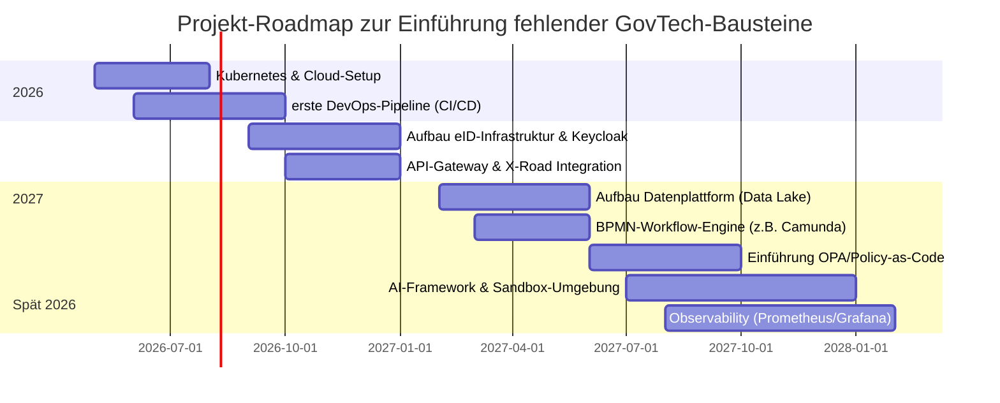

# 📝 Executive Summary

Regierungsprojekte setzen zunehmend auf modulare, cloud-native **GovTech-Stacks**, um digitale Dienste interoperabel, skalierbar und souverän zu gestalten【4†L60-L68】【35†L159-L164】. Basierend auf dem Deutschland-Stack (D-Stack) und internationalen Rahmenwerken (GovStack, Global GovTech Centre) haben wir die gängigen Schichten identifiziert: Infrastruktur/Cloud, Identity & Trust, Interoperabilität/API, Daten, Zahlungsverkehr, Orchestrierung/Workflow, Frontend/UX, Messaging, Policy/Regeln, KI/Automation, Sicherheit/Compliance, Testing/Simulation und Observability. Für jede Schicht listen wir typische Technologien/Standards mit **Kurzbeschreibung, Quelle, Lizenzform** und **öffentlichem Relevanzaspekt** (Datenschutz, Souveränität, Barrierefreiheit). Da der aktuelle App-Stack unbekannt ist, gelten _alle_ Einträge als **“unbekannt/vermutlich fehlt”**. Zum Abschluss fassen wir die Lücken („Gap Analyse“) nach Priorität zusammen und zeigen eine empfohlene Roadmap (Mermaid-Gantt).

## 🖥️ Infrastruktur & Cloud

Fundament für Skalierung, Containerisierung und Deployment【4†L60-L68】【35†L159-L164】.

- **Kubernetes** – quelloffene Container-Orchestrierung (CNCF-Projekt) zur Automatisierung von Deployment und Skalierung【55†L309-L315】 (OSS, Apache 2.0). Sorgt für **Portabilität und Skalierbarkeit** über Rechenzentren und Clouds hinweg【55†L309-L315】. (Relevanz: vermeidet Anbieter-Abhängigkeit, Grundlage für digitale Souveränität) [❌ unbekannt/vermutlich fehlt].
- **Docker/OCI-Container** – Standard für leichtgewichtige, isolierte Deployments (Docker ist OSS, Apache 2.0). Vereinheitlicht Laufzeitumgebung von Anwendungen. (Relevanz: ermöglicht CI/CD und Reproduzierbarkeit) [❌ unbekannt/vermutlich fehlt].
- **OpenShift/OKD** – Kubernetes-Distribution mit Enterprise-Features (RedHat-Produkt, Commercial; OKD Community-Version OSS). Bietet zusätzliche Management-Tools und unterstützt hybride Clouds. [❌ unbekannt/vermutlich fehlt].
- **AWS / Azure / GCP** – Public-Cloud-Plattformen (kommerziell). Global verfügbar, bieten IaaS/PaaS für schnelle Bereitstellung von Infrastruktur. (Datenschutz: Risiko, wenn keine EU-Standorte oder Souveränitäts-Features) [❌ unbekannt/vermutlich fehlt].
- **Sovereign Cloud Stack (SCS)** – offener Referenz-Standard für Cloud-Infrastruktur (IaaS/KaaS), entwickelt von OSB Alliance【35†L159-L164】. Definiert u. a. **Flavor-Naming, Storage-Klassen, IAM-Standards** für souveräne Clouds【35†L159-L164】 (Vorbild für D-Stack). (Souveränität: Basis-Standard, um Vendor-Lock-in zu vermeiden) [❌ unbekannt/vermutlich fehlt].
- **Terraform** – Open Source IaC-Werkzeug (MPL 2.0). Erlaubt deklaratives Provisioning von Cloud-Ressourcen (State, Provider). [❌ unbekannt/vermutlich fehlt].
- **Helm** – Paketmanager für Kubernetes-Charts (OSS, Apache 2.0). Vereinfacht Deployment komplexer Applikationen. [❌ unbekannt/vermutlich fehlt].
- **Serverless (Lambda, Functions)** – Funktionen als Service (z.B. AWS Lambda, Azure Functions). Zur schnellen Skalierung ohne Infrastruktur-Management. (Datenschutz/Verfügbarkeit muss geprüft werden) [❌ unbekannt/vermutlich fehlt].

【51†embed_image】 _Infrastruktur-Diagramm: Moderne CI/CD-Pipeline mit Container-Registry und Kubernetes (Quelle: GovStack Sandbox)【49†L110-L119】【51†】._

## 🔐 Identity & Trust

Zentrale Schicht für Authentifizierung/Autorisierung (Bürger, Behörden, Maschinen)【32†L91-L94】【35†L159-L164】.

- **eID / eIDAS-Trustframework** – Europäische/​nationale Standards für digitale Identitäten. Umfasst z.B. den deutschen Personalausweis (nPA) mit eID-Funktion. (Relevanz: hoher Datenschutz, gesetzliche Vorgaben) [❌ unbekannt/vermutlich fehlt].
- **OpenID Connect / OAuth2** – offener Standard für Single Sign-On (OSS, Mitreiß. von Identity-Providern). Ermöglicht sichere Authentifizierung via zentralem Dienst (z.B. Keycloak, Auth0)【35†L159-L164】. (Datenschutz/Audit: Token-basierte Auth inkl. MFA) [❌ unbekannt/vermutlich fehlt].
- **Keycloak** – Open-Source Identity- und Access-Management (RedHat, Apache 2.0). Bietet SSO, OIDC/SAML, Benutzer- und Rollenmgt. (Viele Verwaltungen nutzen Keycloak als IAM) [❌ unbekannt/vermutlich fehlt].
- **Verifiable Credentials / Decentralized Identity** – W3C-Standard für manipulationssichere digitale Nachweise (eIDAS-Wallets, SSI). Bürger/Maschinen erhalten kryptografisch signierte Berechtigungen. (Relevanz: hohe Vertrauenswürdigkeit, maschinenlesbare Berechtigungen) [❌ unbekannt/vermutlich fehlt].
- **FIDO2/WebAuthn** – Passwortlose Authentifizierung via Hardware-Token (OSS-Standards). Erhöht Sicherheit durch z.B. Smartphones als Authentifikator. (Barrierefreiheit: alternative Login-Methoden) [❌ unbekannt/vermutlich fehlt].
- **PKI und Zertifikate** – Public-Key-Infrastruktur zur Absicherung von Verbindungen (z.B. X.509 Zertifikate, Qualifizierte elektronische Siegel). (Datenschutz/Sicherheit: Basis für HTTPS, Verschlüsselung, Signaturen) [❌ unbekannt/vermutlich fehlt].
- **Machine Identity** – Eigenständige Zertifikate/Tokens für System-to-System-Authentifizierung【4†L169-L177】. Ermöglicht, Software-Agenten eindeutig zu identifizieren (Abschätzung: aus Global GovTech Centre Identity 2.0-Konzept). [❌ unbekannt/vermutlich fehlt].

## 🔄 Interoperabilität & API-Layer

Verbindet Behörden-Plattformen über standardisierte APIs und Mitteldienste【4†L60-L68】.

- **RESTful APIs (JSON/HTTP)** – verbreiteter Stil für Web-APIs (keine Lizenz). Grundlage der meisten Gov-Services (leichtgewichtig, weit unterstützt). (Schnittstellen-Dokumentation z.B. via OpenAPI)【45†L202-L206】. [❌ unbekannt/vermutlich fehlt].
- **GraphQL** – Open-Source API-Query Sprache (OSS, MIT). Bietet flexible Datenabfrage statt fester Endpunkte (Client wählt Felder). [❌ unbekannt/vermutlich fehlt].
- **API-Gateways (Kong, Apigee etc.)** – Servicekomponenten für Authentifizierung, Routing und Throttling von APIs (Kong ist OSS, Apache 2.0). Erlaubt konsistente Verwaltung aller APIs und Verbindungssicherheit. (Relevanz: zentrale Kontrolle, Monitoring) [❌ unbekannt/vermutlich fehlt].
- **Estland X-Road** – Plattform für sicherten Behörden-Datenaustausch【4†L60-L68】【43†L43-L48】. Offen (ESS, Apache 2.0), ermöglicht vertrauenswürdige Datenzugriffe zwischen Regierungsstellen. (Beispiel GovStack/BMG: erprobt in Estland, Anbindung an D-Stack vorgesehen) [❌ unbekannt/vermutlich fehlt].
- **Service-Mesh (Istio, Linkerd)** – Netzwerk-Layer zur Absicherung und Steuerung von microservices (Istio OSS, Apache 2.0). Bietet transparentes Load-Balancing, Verschlüsselung (mTLS) und Telemetrie. [❌ unbekannt/vermutlich fehlt].
- **Enterprise Service Bus (Mule, WSO2)** – Integrationsplattform für Legacy-Systeme (oft OSS/kommerziell). Nutzt Message-Broker, Adapter, verwandelt und vermittelt Daten zwischen heterogenen Systemen. [❌ unbekannt/vermutlich fehlt].
- **Message Brokers (Kafka, RabbitMQ)** – Themen-basiertes bzw. Queue-basiertes Messaging (Kafka OSS, Apache 2.0; RabbitMQ OSS, Mozilla Public). Ermöglicht asynchrone System-Integration und Event-Streaming. (Nachrichtenübermittlung mit hoher Datenrate)【32†L91-L94】 [❌ unbekannt/vermutlich fehlt].
- **REST/OPC-UA Gateway** – für Steuergeräte & IoT (z.B. Bosch openHAB, OPC Foundation). Relevant für Smart-City, aber oft spezielle Domäne. [❌ unbekannt/vermutlich fehlt].

## 📊 Daten

Datenhaltung, Austausch und Governance-Plattformen. Hierzu zählen relationale DBs, Data Lakes und Austauschformate【4†L166-L175】【35†L153-L161】.

- **PostgreSQL / MySQL** – Open-Source relationale DBMS (PostgreSQL BSD/MIT, MySQL GPL). Universell eingesetzt für geschäftskritische Datenbanken. (Datenschutz: evtl. on-premise) [❌ unbekannt/vermutlich fehlt].
- **MongoDB / NoSQL** – Dokumentenorientierte DB (MongoDB OSS/SSPL-Lizenz). Für flexible Datenspeicherung (Formate wie JSON) nützlich. [❌ unbekannt/vermutlich fehlt].
- **Data Lake (z.B. Hadoop/S3)** – zentrales Speichern großer heterogener Datenmengen (HDFS OSS, Apache). Unterstützt Big Data, KI-Analysen und Archivierung. [❌ unbekannt/vermutlich fehlt].
- **Data Mesh** – Architekturprinzip (nicht Produkt) für dezentrale Datenverantwortung【4†L166-L175】. Daten bleiben in Domänen, aber mit globalen Standards verbunden (Meta-Katalog, APIs). (Souveränität: Datentilgung, Nachvollziehbarkeit) [❌ unbekannt/vermutlich fehlt].
- **ETL/Pipelines (Apache NiFi, Airflow)** – Datenintegrationstools (OSS). Übernehmen Extraktion, Transformation, Laden. Ermöglichen automatisierten Datentransfer zwischen Systemen. [❌ unbekannt/vermutlich fehlt].
- **Open Data Portal (z.B. CKAN)** – Plattform zur Veröffentlichung öffentlich-rechtlicher Datensätze (CKAN OSS, AGPL). Fördert Transparenz und Wiederverwendbarkeit von Open Government Data. (Barrierefreiheit: offene Datenformate) [❌ unbekannt/vermutlich fehlt].
- **Nationale Datendrehscheibe / Datenkatalog** – zentrales Verzeichnis aller Datenquellen. Beinhaltet Metadaten und Zugriffskontrollen (inspiriert durch GovStack _National Data Commons_【4†L166-L175】). [❌ unbekannt/vermutlich fehlt].
- **Analytics & ML-Plattform** – Tools wie Jupyter, TensorFlow (OSS) für Data Science. Unterstützt KI-Entwicklung, erlaubt Anonymisierung und Pseudonymisierung (Datenschutz) [❌ unbekannt/vermutlich fehlt].

## 💸 Zahlungsverkehr & Finanzen

Komponenten für Gebühren, Leistungen und Transfers【35†L155-L161】.

- **Payment APIs (Stripe, PayPal, Adyen)** – Externe Zahlungsdienstleister (kommerziell). Ermöglichen Kreditkarten- und Online-Zahlungen. (Souveränität: sens. Finanzdaten landen außerhalb) [❌ unbekannt/vermutlich fehlt].
- **SEPA / PSD2-APIs** – EU-Standard für Banktransaktionen. Ermöglicht direkter Überweisungen und Kontoinformationen (z.B. Bank-zu-App Schnittstellen). (Datenschutz: strikte Regulierung) [❌ unbekannt/vermutlich fehlt].
- **Smart Contracts (Blockchain)** – z.B. Ethereum oder Hyperledger (OSS). Automatisierte Verträge für Treuhand, Sanktionen oder Subventionen. (Relevanz: Experimente etwa in SCS) [❌ unbekannt/vermutlich fehlt].
- **ERP/Haushaltssoftware (z.B. SAP FS/MP)** – Finanzmanagement-Systeme (kommerziell). Erfassen Haushaltsstellen, Budgets und Zahlungen der öffentlichen Hand. (Nicht unbedingt digital-first, aber Backend-Fundament) [❌ unbekannt/vermutlich fehlt].
- **Treasury-/Buchhaltungssystem** – Öffentliche Finanzsoftware. Z.B. DATEV (kommerziell) oder spezialisierte Cloud-Lösungen (Lizenzen). [❌ unbekannt/vermutlich fehlt].

## 🧠 Service-Orchestrierung & Workflow

Koordination von Geschäftsprozessen und Ereignissen.

- **BPMN-Engines (Camunda, Flowable)** – Open-Source Workflow-Automatisierung (Camunda Community OSS, Apache 2.0). Modellieren Geschäftsprozesse als BPMN-Flows, inkl. Aufgaben, Entscheidungen. (Relevanz: Standard für komplexe Behördengänge) [❌ unbekannt/vermutlich fehlt].
- **Temporal** – moderne Orchestrierungsplattform (OSS, MIT) mit mikroservice-freundlichen Workflows (codebasiert). [❌ unbekannt/vermutlich fehlt].
- **Niedrig-Code-Plattformen (OutSystems, Appian)** – Entwicklungswerkzeuge mit Drag-and-Drop (kommerziell). Erlauben Behörden, Formulare/Prozesse selbst zu erstellen (Relevanz: Teil der D-Stack-Ziele). [❌ unbekannt/vermutlich fehlt].
- **Event-Driven Architectures** – Tools wie Knative Events oder Kafka Streams für reaktive Prozesse (OSS). Erlauben lose gekoppelte Service-Interaktionen. [❌ unbekannt/vermutlich fehlt].
- **Orchestrierungssprache** – z.B. **BPEL** (oss) oder Cloud-Native Workflows (Kubeflow, Argo Workflows). Für verteilte Aufgabe-Ausführung. [❌ unbekannt/vermutlich fehlt].
- **Chatbots / Voice Assistants** – RPA- oder Conversational-Engine (kommerziell/OSS) für Bürgeranfragen (z.B. IBM Watson Assistant, Rasa OSS). Unterstützt automatisierte Formulareingaben und Dialoge (Barrierearmut: natürliche Sprache). [❌ unbekannt/vermutlich fehlt].

## 🖥️ Frontend / UX

Bürger- und Verwaltungsoberflächen – moderne Web-Technologien und Designsysteme.

- **React / Angular / Vue** – Populäre Web-Frameworks (alle OSS, MIT). Erlauben komplexe, interaktive Benutzeroberflächen. (Nutzen: schnelle UI-Entwicklung, große Community) [❌ unbekannt/vermutlich fehlt].
- **Web Components (Lit, Polymer)** – Standard für wiederverwendbare UI-Elemente (OSS, BSD/MIT). Unterstützt Shadow DOM für modulare Designs. [❌ unbekannt/vermutlich fehlt].
- **UX-Designsystem (z.B. Gov DS, Designsystem OZG)** – Sammlung von UI-Komponenten und Guidelines (variabel lizenziert). Sicherstellen konsistenter, barrierefreier Look&Feel. (Ziel: Inklusion, Barrierefreiheit nach WCAG) [❌ unbekannt/vermutlich fehlt].
- **WCAG / Barrierefreiheits-Frameworks** – Richtlinien (ISO/IEC 40500) und Werkzeuge (ColourContrastCheck, WAI-ARIA-Tools). Umfassende Barrierefreiheit sicherstellen (D-Stack-Vorgabe: Leichte Sprache, Screenreader-Kompatibilität). [❌ unbekannt/vermutlich fehlt].
- **Responsive Design / Mobile-First** – keine Technologie per se; gilt als Standard (CSS-Media-Queries, Bootstrap etc.) für Zugänglichkeit auf allen Geräten. [❌ unbekannt/vermutlich fehlt].
- **Internationalisierung (i18n)** – Frameworks/Libs (react-intl, Angular i18n). Notwendig für mehrsprachige Dokumente. (Relevanz: Einwanderer, EU-weites Publikum) [❌ unbekannt/vermutlich fehlt].

## 📬 Messaging & Kommunikation

System- und Bürger-Kommunikation – E-Mail, Benachrichtigungen, Streaming.

- **E-Mail-Server (Postfix/Dovecot)** – OSS-Mailserver (Postfix BSD, Dovecot MIT). Versendet Newsletter/Behördenpost, empfängt Service-Anfragen. (Sicherheit: SPF, DKIM, TLS) [❌ unbekannt/vermutlich fehlt].
- **Benachrichtigungsdienste** – z.B. GovStack _Notification BB_ (Telco/SMS, E-Mail). Lösungen wie AWS SNS/SES (kommerziell) oder Open-Source-Alternativen (Postal). Ermöglicht Push-Notifications an Bürger (E-Mail, SMS, Push-Apps). [❌ unbekannt/vermutlich fehlt].
- **Kafka / RabbitMQ** – (siehe Interoperabilität) als Herzstück für asynchrone Events. Ideal für Echtzeit-Datenverteilung (Public-API-Updates, Log-Streams). [❌ unbekannt/vermutlich fehlt].
- **WebSockets / MQTT** – bidirektionale Web-Kommunikation (OSS, Open-Standard). Für Push-Kanäle in Web-Frontends (Browser-Alerts, Chat-Apps) oder IoT-Geräte. [❌ unbekannt/vermutlich fehlt].
- **Unified Communications (Matrix, Rocket.Chat)** – Kooperationsplattformen (OSS). Bieten Chat/Collaboration im Inland (z.B. Matrix OMS als Open-Mail-Standard). [❌ unbekannt/vermutlich fehlt].
- **Social Media Connectoren** – APIs zu Twitter/Facebook (kommerziell/lichtlos) für Behördeninformation (Debatten). (Datenschutz: Schnittstellen kritisch) [❌ unbekannt/vermutlich fehlt].

## 📜 Policy & Regelwerke

Maschinenlesbare Umsetzung von Gesetzen und Regeln【4†L97-L100】.

- **Policy-as-Code (Open Policy Agent)** – Open-Source Policy-Engine (Apache 2.0). Richtlinien (Sicherheitsregeln, Zugriffsrechte) in Code festlegen und automatisch prüfen. (Beispiel: OPA-Gatekeeper für Kubernetes-Pods) [❌ unbekannt/vermutlich fehlt].
- **Business-Regel-Engines (Drools, Camunda DMN)** – Entscheidungstabellen und Regeln (Drools OSS, Apache 2.0). Ermöglicht organisatorische Richtlinien (Reisekosten, Schwellenwerte) explizit zu modellieren. [❌ unbekannt/vermutlich fehlt].
- **Machine-Readable Law (LegalRuleML)** – Standards für Gesetzestextstrukturierung (ISO/IIJML). Noch Forschungsgebiet; Ziel, Gesetze in Entscheidungsbäume zu überführen【4†L97-L100】. [❌ unbekannt/vermutlich fehlt].
- **Consent-Management (GMG/GVA)** – Verzeichnis-Verzeichnis (GovStack Consent BB【32†L91-L94】). Verzeichnet Bürger-Einwilligungen in Datenverarbeitung. (Datenschutz: zentrales Opt-In-Register) [❌ unbekannt/vermutlich fehlt].
- **OpenAPI für Policy-Exposition** – Dokumentation von Schnittstellen (OpenAPI-Standard, OSS). Fördert klare, überprüfbare Interfaces【45†L202-L206】. (Barrierefreiheit: maschinenlesbare Spezifikationen) [❌ unbekannt/vermutlich fehlt].

## 🤖 KI & Automatisierung

Beinhaltet ML/AI-Modelle, Agenten und Automatisierungs-Frameworks.

- **LLM (GPT, Llama2, cohere)** – Large Language Models (teilweise Open-Source, z.B. Meta Llama2, Apache 2.0). Einsatz für Chatbots, Dokumentenanalysen oder Fachassistenz (Dokumenten-Generierung, Auskünfte). (Datenschutz: oft lokal/verschlüsselt laufen lassen) [❌ unbekannt/vermutlich fehlt].
- **Agenten-Frameworks (LangChain, AutoGPT)** – Bibliotheken (OSS, MIT/BSD) zum Aufbau autonomer Agenten mit KI-Logik. Koordinieren mehrere Modelle und API-Aufrufe. [❌ unbekannt/vermutlich fehlt].
- **KI-Plattformen (TensorFlow, PyTorch)** – ML-Frameworks (OSS, Apache/BSD). Für Training von Modellen (z.B. Bild-/Textklassifikation in Verwaltung). [❌ unbekannt/vermutlich fehlt].
- **Robotic Process Automation (RPA)** – z.B. UiPath (kommerziell) oder OSS-Tools (TagUI). Automatisiert repetitive Verwaltungsaufgaben (Formularausfüllung). (Wenig digitale Souveränität, aber Hilfestellung für Legacy) [❌ unbekannt/vermutlich fehlt].
- **Daten- und Prozesssimulation** – „Digital Twin“ (Hardware- und Softwaresandboxen)【4†L169-L177】. Umgebung, um Regeländerungen und Systeme (z.B. Capgemini Digital Twin) sicher zu testen. [❌ unbekannt/vermutlich fehlt].
- **KI-Governance-Tools** – (Fairness, Bias-Checking): Crisp (SAP), IBM AI Fairness 360 (OSS). [❌ unbekannt/vermutlich fehlt].

## 🛡️ Sicherheit & Compliance

Querschnittsschicht über alle Bereiche: Schutz, Überwachung und Regulatorik.

- **IAM & Authentifizierung** – (schon erwähnt unter Identity). Hinzufügen: **Multi-Faktor-Authentifizierung (MFA)** via TOTP oder Hardware-Token (z.B. Yubikey OSS Firmware). [❌ unbekannt/vermutlich fehlt].
- **Zero-Trust-Architektur** – Konzept: „nie vertrauen, immer verifizieren“. Setzt Microsegmentierung um und überprüft Identität bei jedem Zugriff. (Ansatz, nicht Produkt). [❌ unbekannt/vermutlich fehlt].
- **Security Information and Event Management (SIEM)** – Log-Sammlung und -Analyse (Elastic Stack, OSS; Splunk kommerziell). Erlaubt Monitoring und Analyse sicherheitsrelevanter Ereignisse. [❌ unbekannt/vermutlich fehlt].
- **WAF / API Firewall (ModSecurity, Kong) –** Schutz (OSS) gegen Web-Angriffe (XSS, SQLi) auf API-/Web-Ebene. [❌ unbekannt/vermutlich fehlt].
- **Verschlüsselung (TLS, VPN)** – Kerntechnologien (TLS OSS-Bibliotheken, OpenVPN OSS). Sicherung aller Verbindungen nach außen (EU-Standards). [❌ unbekannt/vermutlich fehlt].
- **Penetration/Code-Scanning (OWASP ZAP, SonarQube)** – Sicherheitsprüfungen (OSS). Regelmäßige Audits für Apps und Services. [❌ unbekannt/vermutlich fehlt].

## 🧪 Testing / Simulation

Qualitätssicherung und Risikoabschätzung vor dem Produktiveinsatz.

- **Automatisierte Tests (JUnit, Selenium)** – Unit-, Integrations- und UI-Tests (OSS). Für Funktions- und Regressionstests. [❌ unbekannt/vermutlich fehlt].
- **Last- & Performance-Testing (JMeter, k6)** – Tools (OSS) zum Simulieren von Nutzerlast, um Skalierbarkeit zu prüfen. [❌ unbekannt/vermutlich fehlt].
- **Chaos Engineering (Chaos Monkey)** – Ansätze (OSS), um Robustheit von Systemen durch gezielte Ausfälle zu testen (Stresstests). [❌ unbekannt/vermutlich fehlt].
- **Digital Twin / Sandbox-Umgebung** – Exakte Nachbildung wichtiger Systeme zur gefahrlosen Änderungstests (z.B. Policy-Änderungen)【4†L169-L177】. [❌ unbekannt/vermutlich fehlt].
- **Contract Testing (Pact)** – Service-Contract-Tests (OSS), um API-Kompatibilität zwischen Komponenten zu sichern. [❌ unbekannt/vermutlich fehlt].

## 📈 Observability & Monitoring

Metriken, Logs und Dashboards für Betriebssicherheit.

- **Prometheus & Grafana** – OSS Monitoring-Stack (Apache 2.0). Prometheus sammelt Metriken, Grafana visualisiert sie (Dashboards). (Weit verbreitet in Cloud-Umgebungen) [❌ unbekannt/vermutlich fehlt].
- **ELK Stack (Elasticsearch, Logstash, Kibana)** – OSS Logging-Lösung (Elastic-Lizenz für ES). Aggregiert Logs, erlaubt Volltextsuche und Monitoring-Dashboards. [❌ unbekannt/vermutlich fehlt].
- **OpenTelemetry / Jaeger** – OSS Tracing-Instrumentierung. Verfolgt Serviceaufrufe durch verteilte Systeme (Request-Tracking). [❌ unbekannt/vermutlich fehlt].
- **SIEM & APM (Splunk, Datadog, Dynatrace)** – kommerzielle Komplettlösungen. Konsolidieren Monitoring-, Logging- und Sicherheits-Daten. [❌ unbekannt/vermutlich fehlt].

---

## 📊 Zusammenfassungstabelle (Layer vs. Beispiel-Items)

| **Layer**                  | **Beispieltechnologien/-Standards**                                                        | **Lizenz/Status**                   | **Anwendungsrelevanz (Datenschutz/Souveränität)**                             |
| -------------------------- | ------------------------------------------------------------------------------------------ | ----------------------------------- | ----------------------------------------------------------------------------- |
| Infrastruktur & Cloud      | Kubernetes, Docker, OpenStack, AWS/Azure, Terraform, Sovereign Cloud Stack【35†L159-L164】 | Mix: OSS (Apache/BSD) & kommerziell | Globale Skalierung, Vermeidung Vendor-Lock-in, souveräne Cloud Nutzung        |
| Identity & Trust           | eIDAS/eID (nPA), OpenID Connect, Keycloak, FIDO2, Verifiable Credentials【32†L91-L94】     | Meist OSS (Open-Standards)          | Sichere Authentifizierung, Datenschutz (digitale Identitäten)                 |
| Interop / API              | REST/JSON, GraphQL, API-Gateways (Kong), X-Road, Service Mesh (Istio), ESB                 | OSS/Standards, kommerzielle         | Cross-Agency-Datenfluss, stabile Integration, Governance-konform              |
| Daten                      | PostgreSQL, Data Lake (HDFS), CKAN, Data Mesh, Data Governance Tools【4†L166-L175】        | OSS/BSD, teils proprietär           | Einheitlicher Datenaustausch, Transparenz, Anonymisierung, Open Data          |
| Zahlungsverkehr            | SEPA/PSD2 APIs, Stripe, Open Banking, Smart Contracts (Ethereum)                           | Verschieden (Bank-APIs meist offen) | E-Government-Kassenbetrieb, EU-Standard, digitale Souveränität (EMV)          |
| Orchestrierung / Workflow  | BPMN (Camunda), Temporal, Low-Code (OutSystems), Event-Streaming (Kafka Streams)           | OSS/kommerziell                     | Automatisierte Geschäftsprozesse, Bearbeitung von Bürgeranträgen              |
| Frontend / UX              | React, Angular, Web Components, Gov Design System, WCAG                                    | OSS/variabel                        | Barrierefreie, benutzerfreundliche Portale, mehrsprachige Oberflächen         |
| Messaging & Kommunikation  | Kafka, RabbitMQ, SMTP (Postfix), SMS/Notification-APIs, WebSocket/MQTT, Chat-Plattformen   | OSS, kommerziell                    | Zuverlässige Informationskanäle (Anwenderbenachrichtigungen, Echtzeitdaten)   |
| Policy & Regeln            | Open Policy Agent, Drools (DMN), LegalRuleML, Consent-Registry (GovStack Consent BB)       | OSS / offene Spezifikationen        | Rechtskonformes Verhalten, maschinenlesbare Gesetze, Transparenz (OPS)        |
| KI & Automation            | TensorFlow, PyTorch, LLM (GPT, Llama2), RPA-Tools, Agent-Frameworks                        | OSS/kommerziell (AI-Dienste)        | Effizienzsteigerung, Bürgerkontakt (Chatbots), Datenanalyse, Vorsichtsprinzip |
| Sicherheit & Compliance    | IAM (siehe Identity), SIEM (Elastic, Splunk), WAF, TLS, PenTests (OWASP-ZAP)               | OSS/kommerziell                     | Schutz sensibler Daten, DSGVO-Konformität, Resilienz gegen Angriffe           |
| Testing / Simulation       | JMeter, k6, Selenium, Chaos Monkey, Digital-Twin-Sandbox【4†L169-L177】                    | OSS                                 | Qualitätssicherung, Lasttests, Risikofreie System-Updates                     |
| Observability / Monitoring | Prometheus, Grafana, ELK, OpenTelemetry, Datadog                                           | OSS/kommerziell                     | Betriebstransparenz, Alarmierung, Einhaltung von SLAs                         |

## 🏆 Fehlende Technologien – Lückenanalyse

Da der vorhandene App-Stack unbekannt ist, gelten alle o.g. Einträge zunächst als **unbekannt (vermutlich fehlt)**. Die kritischsten Lücken (aus internationaler GovTech-Perspektive) sind:

- **🔴 Kritisch:** _Identity 2.0 (eIDAS-Wallet, Machine Identity), Datenplattform inkl. Governance (Data Commons【4†L166-L175】)_, _Policy-as-Code (OPA, maschinenlesbare Gesetze【4†L97-L100】)_, _Zero-Trust-Security (konsequentes IAM/MFA)_. Ohne diese fehlen Grundpfeiler für Datenschutz und Skalierung.
- **🟠 Hoch:** _Interoperabilitätsdienste (z.B. X-Road/PEPPOL), Observability (Prometheus/Grafana), Skalierbare Workflow-Engines (Camunda, Temporal), Sandboxen/Digital Twins【4†L169-L177】_. Diese schränken Effizienz und Resilienz ein.
- **🟡 Mittel:** _Designsystem/WCAG (Barrierefreiheit), API-Gateways, Ereignis-Plattform (Kafka), Consent-Management, Kubernetes-native DevOps (CI/CD)_. Wichtig für Reifegrad, aber kurzzeitiger kompensierbar.
- **🟢 Gering:** _Frontend-Frameworks (React/Angular) und Standarddatenbanken (PostgreSQL) – diese sind meist schon vorhanden_, dazu kommen Social-Media-Connectoren oder exotic Features.

**Erklärung Roadmap:** Phase 1 (H2 2026) startet mit moderner Infra (Kubernetes, SCS-Konformität【35†L159-L164】) und ersten DevOps-Prozessen. In H2/2026 folgen _Identity & API_: eID/Gemeinschafts-Login und ein API-Gateway/X-Road für nahtlose Behördenkommunikation. 2027 kommt der _Daten- und Workflow-Aufbau_: zentrale Datenplattform und BPMN-Engine (Camunda) zur Automatisierung. Gegen Mitte 2027 implementiert man Policy-as-Code (z.B. OPA) und beginnt mit KI/Agentik- und Observability-Lösungen. Diese sukzessive Erweiterung schließt die identifizierten Lücken in kritischer Reihenfolge.

**Quellen:** Die aufgeführten Technologien und Standards basieren auf GovStack-/Deutschland-Stack-Initiativen und Best-Practice aus internationalen GovTech-Leitfäden【4†L60-L68】【32†L91-L94】【35†L159-L164】. Sie gelten als Ausgangspunkt, um das Backend systematisch zu modernisieren.
